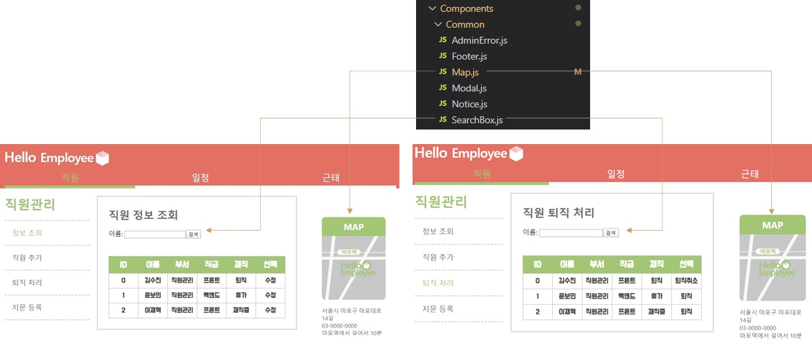

# HELLO-EMPLOYEE Admin page

2020.03.23 ~ 2020.04.24

첫 풀스택 프로젝트를 무사히(?) 마치고 처음으로 팀원들과 함께한 프로젝트

## 90Factory Team Project

팀 프로젝트 전체의 세부 내용은 아래 주소에서 확인 하실 수 있습니다.

https://github.com/90factory/3rd_employee

## Admin-Page

관리자 페이지의 프론트엔드 부분을 담당하여 개발을 진행하였습니다.

### `Container - Presenter`

Component 를 logic과 action을 관리하는 Container 와 view 를 관리하는 Presenter 로 나누어 관리 하였습니다.

또한 자주 사용하는 Component 는 Common Component 에 만들어 놓고 재 사용 하였습니다.

### `Redux`

Redux를 사용하여 Store 에서 state를 관리하였습니다.

### `Axios & Api Call`

Axios를 모듈화 하여 Ajax 로 서버와 통신하였습니다.

BackEnd에서 열어준 API들을 Swagger로 서버 연결 전에 확인하여 코드를 쉽게 짤 수 있었습니다.
